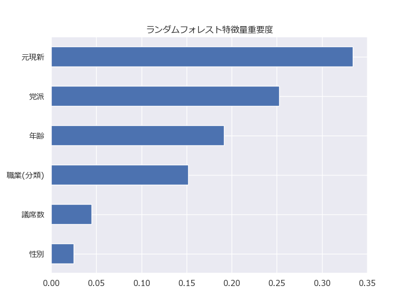

# 2025年参議院選挙 当落予測プロジェクト

参議院選挙候補者データ(比例代表のデータは含めない)をもとに、**当落を予測する機械学習モデル**を構築したプロジェクトです。  ロジスティック回帰とランダムフォレストを比較し、ROC AUCを用いてモデル性能を評価しています。  さらに、ユーザー入力で候補者の当落確率を予測する簡易アプリを作成しています。

## (1)背景・目的

年齢、性別、党派、職業といった特徴量が当選にどの程度影響しているのか定量的に把握することが
難しいという現状がある。このプロジェクトでは、2025年に実施された参議院選挙の過去データを分析し、
選挙戦略や候補者選定に活用されることを想定しています。

## (2)データの収集と整理

- **使用データ:** 2025年参議院選挙候補者データ(候補者別得票数（選挙区))-
- **特徴量**
  - 年齢
  - 性別
  - 党派
  - 元現新（現職・元職・新人）
  - 議席数
  - 職業
   
- **前処理**
  - ラベルエンコーディング
  - 欠損値処理
  - 当落ラベルを 1（当選） / 0（落選） に変換

## (3)データ分析

-**使用したモデル:**
- **ロジスティック回帰**
  - 最大反復回数: 1000
  - クラスの不均衡に対応（`class_weight='balanced'`）
- **ランダムフォレスト**
  - GridSearchCVでハイパーパラメータチューニング
  - パラメータ例: `n_estimators=[100,200,300]`, `max_depth=[None,5,10]`
  - クラスの不均衡に対応（`class_weight='balanced'`）

- **評価指標**
  - 混合行列
  - 適合率・再現率・F1スコア
  - ROC曲線

---

## 結果

- ランダムフォレストのROC AUCは **0.898** と、ロジスティック回帰の0.735より高精度

- **重要な特徴量(降順)**
  1. 元現新
  2. 党派
  3. 年齢
  4. 職業
  5. 議席数
  6. 性別

**特徴量重要度の例（画像をここに貼る）**

**ROC曲線比較（画像をここに貼る）**

---

## デモ・使い方

Pythonスクリプト `data_machine_learning.py` を実行すると、ユーザー入力から当落予測ができます。

-**入力例**
名前: 佐藤 武
年齢: 45
性別: 男性
党派: 自由民主党
元現新: 現職
議席数: 2
職業: 政治家・政党関係

-**出力例**-
田中太郎さんの当選確率は 78.50% → 予測ラベル: 当選
（使用モデル: ランダムフォレスト）
